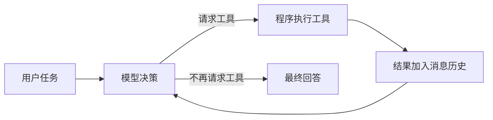

<p align="center">
  
</p>

<h1 align="center">zero-to-agent</h1>

<p align="center">从一次工具调用开始，理解 Agent 如何行动、循环与协作。</p>
<p align="center">Python · Tool Calling · Agent Loop · LangChain · LangGraph · Multi-Agent</p>

## 这个项目是什么？

这是一个学习 **AI Agent 基础理论与实现机制** 的个人实践项目。通过一组循序渐进的 Python 示例，把工具调用、消息传递、循环控制、规划、反思和多智能体协作拆开来看，再逐步组合起来。

项目从手写字符串协议开始，过渡到模型原生 Tool Calling，再用手写循环和 LangGraph 展示 Agent 的执行过程，最后探索 Supervisor 如何协调多个具有不同职责的 Agent。示例围绕天气查询、文件整理和代码生成展开，便于把注意力放在机制本身。

适合已经了解 Python 基础、希望弄清楚“模型如何从回答问题走向执行任务”的学习者。

## 学习路线

| 阶段 | 核心问题 | 主要内容 |
| --- | --- | --- |
| 01 · Tool Call | 模型如何表达“我要调用工具”？ | 字符串协议、Prompt 协议、原生工具调用、API 返回结构 |
| 02 · Agent Loop | 一次调用如何变成持续完成任务？ | 消息历史、工具结果回传、ReAct、状态图、Reflection、Planning |
| 03 · Multi-Agent | 多个 Agent 如何分工并交换结果？ | Supervisor、Agent as Tool、共享状态、条件边路由 |

理解这些示例时，可以始终追踪四个问题：**模型输出了什么、程序执行了什么、状态如何变化、什么时候停止。**

## 示例导航

### 1. Tool Call：让模型连接工具

| 文件 | 学习重点 |
| --- | --- |
| [01_string_protocol.py](1.Tool%20Call/01_string_protocol.py) | 用固定字符串模拟模型输出，手写解析与函数分发；无需连接模型 |
| [02_prompt_protocol_real_model.py](1.Tool%20Call/02_prompt_protocol_real_model.py) | 用 Prompt 约定 `<Tool>` / `<Args>` 格式，再解析真实模型输出 |
| [03_langchain_native_toolcall.py](1.Tool%20Call/03_langchain_native_toolcall.py) | 使用 `@tool`、`bind_tools` 和 `ToolMessage`，把工具结果交回模型 |
| [true_output.py](1.Tool%20Call/true_output.py) | 观察 API 原始响应，以及工具调用的 `id`、`name`、`arguments` |

这里的天气和时间工具返回预设数据，用于观察调用过程，并非实时查询服务。

### 2. Agent Loop：让模型持续行动

这一章以“检查 inbox → 移动文件到 archive → 查看结果 → 总结”为主线，对比不同组织方式。

| 文件 | 学习重点 |
| --- | --- |
| [01_while_loop.py](2.AgentLoop/01_while_loop.py) | 手写有轮次上限的循环，观察模型决策、工具执行与结果回传；实际使用 `for` 控制轮次 |
| [02_create_agent.py](2.AgentLoop/02_create_agent.py) | 使用 `create_tool_calling_agent` + `AgentExecutor` 封装循环 |
| [02_5_langgraph_react.py](2.AgentLoop/02_5_langgraph_react.py) | 将模型与工具拆成节点，通过条件边决定继续或结束 |
| [03_langgraph_reflection.py](2.AgentLoop/03_langgraph_reflection.py) | 工具执行后增加 Reflection 节点，生成下一步建议 |
| [04_langgraph_plan_execute.py](2.AgentLoop/04_langgraph_plan_execute.py) | 先生成计划，再进入 ReAct + Reflection 执行循环 |

基础循环可以表示为：



规划示例在循环前生成计划；反思示例在工具执行后补充建议。它们展示的是不同控制结构，效果仍需要结合实际执行结果判断。

### 3. Multi-Agent：让多个 Agent 分工

| 文件 | 学习重点 |
| --- | --- |
| [01_two_experts.py](3.MultiAgent/01_two_experts.py) | 把文件 Agent 和代码 Agent 包装成工具，由 Supervisor 调用并汇总 |
| [02_conditional_edges.py](3.MultiAgent/02_conditional_edges.py) | 把 Agent 放进独立节点，由 Supervisor 和条件边路由，并通过状态传递报告 |

两个示例都围绕 `file_agent` 与 `code_agent` 展开：前者整理文件，后者生成代码文件，Supervisor 负责协调。这里重点是职责划分与结果传递，并不表示多个 Agent 会并行运行。

## 开始运行

项目使用 **uv + Python 3.13** 管理环境和依赖。以下命令在项目根目录执行，适用于 Windows PowerShell。

### 1. 安装 uv 并同步环境

如果尚未安装 uv，可参考 [uv 官方安装说明](https://docs.astral.sh/uv/getting-started/installation/)。安装后重新打开终端，确认可用：

```powershell
uv --version
uv sync --locked
```

uv 会根据 `.python-version` 选择 Python 3.13，并根据 `uv.lock` 创建项目内的 `.venv`、安装锁定的依赖；本机缺少对应 Python 时会自动下载。无需手动激活虚拟环境，后续统一使用 `uv run` 执行示例。

- `pyproject.toml`：项目元信息、Python 范围和直接依赖。
- `uv.lock`：锁定依赖解析结果，应提交到版本库。
- `.python-version`：项目默认 Python 版本。
- `.env.example`：可复制的模型连接配置。

### 2. 先运行不依赖模型的示例

```powershell
uv run python "1.Tool Call/01_string_protocol.py"
```

观察固定的模型输出如何被解析成工具名称和参数，再由 Python 执行对应函数。

`2.AgentLoop/02_create_agent.py` 保留 `AgentExecutor` / `create_tool_calling_agent` 的教学实现，改为从 `langchain_classic.agents` 导入；多 Agent 示例继续使用 `langchain.agents.create_agent`。两者的依赖已纳入同一个 uv 环境。

### 3. 配置模型连接

在项目根目录复制配置模板（已有 `.env` 时跳过此步），再按自己的模型服务修改：

```powershell
Copy-Item .env.example .env
```

大多数示例会读取以下变量，未设置时使用代码中的默认值：

```dotenv
MODEL=qwen3.5:4b
BASE_URL=http://localhost:11434/v1/
API_KEY=ollama
```

这是源码默认的本地连接配置，需要对应服务已启动、模型已准备好。也可以替换为所用服务的模型名、兼容接口地址和密钥。运行原生 Tool Calling 与 Agent 示例时，模型及接口需要支持工具调用。

`1.Tool Call/true_output.py` 是例外：模型名在代码中固定为 `qwen3.6-flash`，并从环境读取 `BASE_URL` 和 `API_KEY`；运行前需按自己的服务调整该文件中的模型名。

`.gitignore` 已忽略 `.env`、`.venv/` 和 Python 缓存；配置模板 `.env.example` 保留在版本库中。

### 4. 按顺序体验

```powershell
# Prompt 协议与原生工具调用
uv run python "1.Tool Call/02_prompt_protocol_real_model.py" "帮我查一下 Beijing 的天气"
uv run python "1.Tool Call/03_langchain_native_toolcall.py"

# 手写循环 → 状态图 → 反思 → 规划
uv run python "2.AgentLoop/01_while_loop.py"
uv run python "2.AgentLoop/02_create_agent.py"
uv run python "2.AgentLoop/02_5_langgraph_react.py"
uv run python "2.AgentLoop/03_langgraph_reflection.py"
uv run python "2.AgentLoop/04_langgraph_plan_execute.py"

# 多 Agent 协作的两种组织方式
uv run python "3.MultiAgent/01_two_experts.py"
uv run python "3.MultiAgent/02_conditional_edges.py"
```

多数示例支持在命令末尾传入任务文本；不传时使用文件内的默认任务。部分系统提示词固定了目标和执行顺序，自定义任务时也应一起检查提示词。

**文件操作说明：** Agent Loop 和 Multi-Agent 示例启动时会删除并重建所在章节的 `demo_workspace/`。不要在其中存放需要保留的文件，也不要同时运行共享同一目录的示例。当前路径拼接未实现严格的目录边界校验，适合用默认演示任务学习，不应直接用于处理不可信路径或重要文件。

### 5. 日常依赖管理

```powershell
# 添加依赖，同时更新 pyproject.toml、uv.lock 和环境
uv add 包名

# 删除依赖
uv remove 包名

# 拉取项目更新后，按锁文件同步环境
uv sync --locked

# 主动升级允许范围内的依赖，并同步环境
uv lock --upgrade
uv sync --locked
```

常规运行使用 `uv run python "示例路径.py"`；需要严格检查锁文件与配置是否一致时，使用 `uv run --locked python "示例路径.py"`。更多用法见 [uv 项目指南](https://docs.astral.sh/uv/guides/projects/)。

## 建议怎样学？

1. **先预测，再运行。** 读完工具定义与提示词，猜测下一次调用的名称和参数。
2. **追踪消息历史。** 看清模型请求、`tool_call_id` 和工具结果如何对应。
3. **对比相邻示例。** 从手写循环到状态图，观察哪些机制被封装、哪些状态仍需自己管理。
4. **每次只改一个变量。** 修改工具描述、任务或停止条件，观察执行轨迹如何变化。
5. **验证最终状态。** 对照目录变化与 Agent 的总结，检查任务是否真的完成。

## 项目范围

这是持续积累的学习示例集，当前覆盖工具调用、单 Agent 循环、规划与反思、多 Agent 协作。示例保留了直接可读的控制流程，依赖由 uv 统一管理并锁定，尚未包含自动化测试、持久化记忆和生产级文件隔离。

学习目标是能读懂并解释：**一次请求，如何经过模型决策、工具执行、状态更新与协作，最终变成一个完成的任务。**

